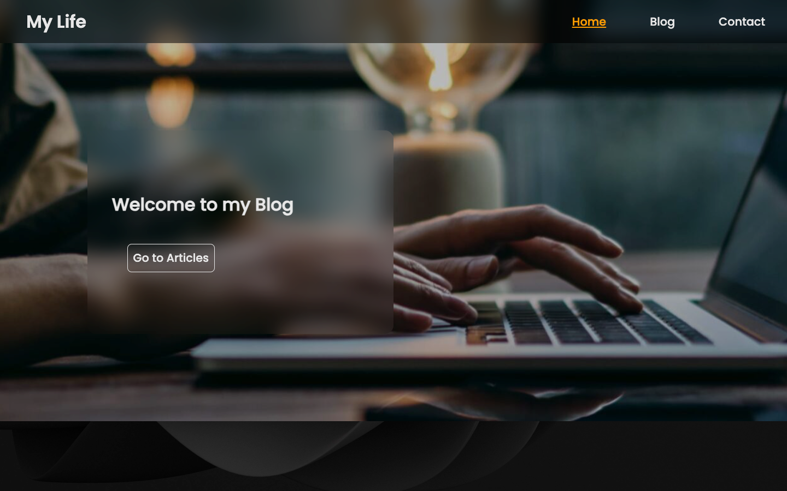
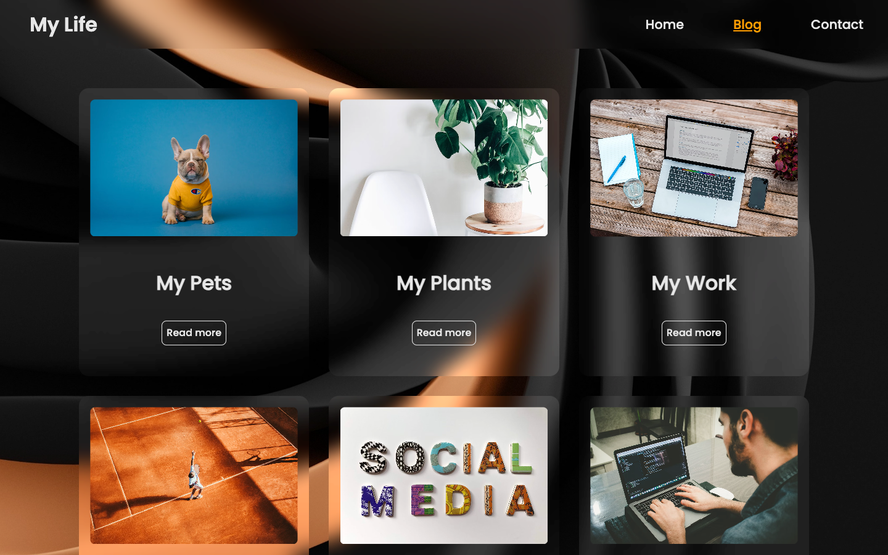
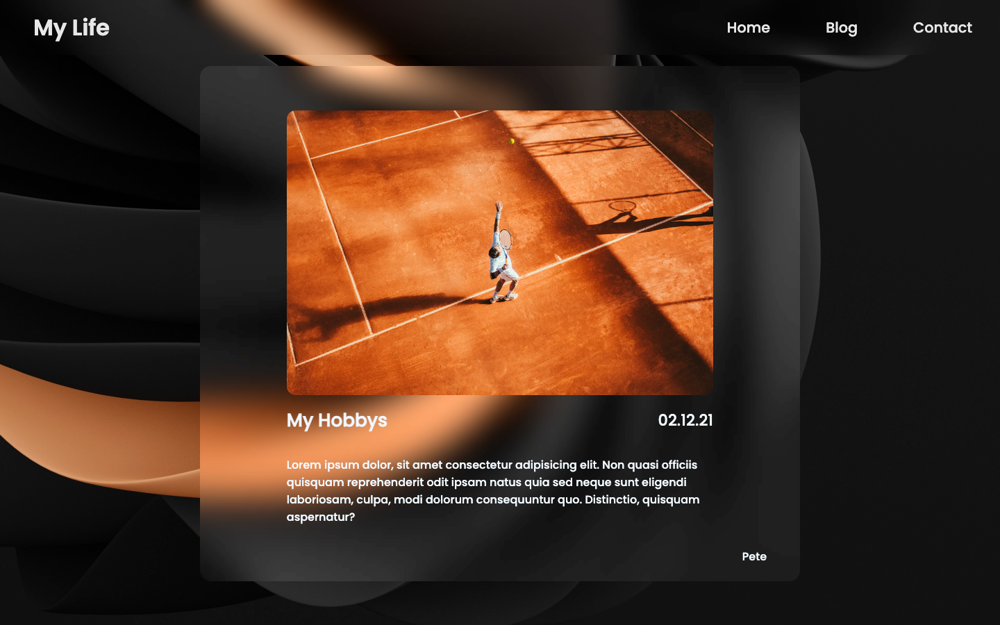

# Project Simple Blog

A practical project for Supercode Fullstack Web-Dev Bootcamp.
in This project the Developer has been given an Array with objects of Blogs and Posts and should use React Router Dom, useState and Map Method to create the posts and show it in the web App using React.

## Demo

You can check the result out in the following video:

https://youtu.be/MjI6RyIvtks

## Deployment

To deploy this project click the link below

https://glittery-torrone-0d598e.netlify.app/

## Tech Stack

**Client:** HTML, SCSS, Javascript, rect, Vite, react Route Dom

**Server/Deployment:** Netlify

## Authors

- [@Samuel Aliyari](https://github.com/samuelaliyari)

## Screenshots

## Upcoming Features

🚧 Login Function

🚧 Profiles 

🚧 User dashboard
